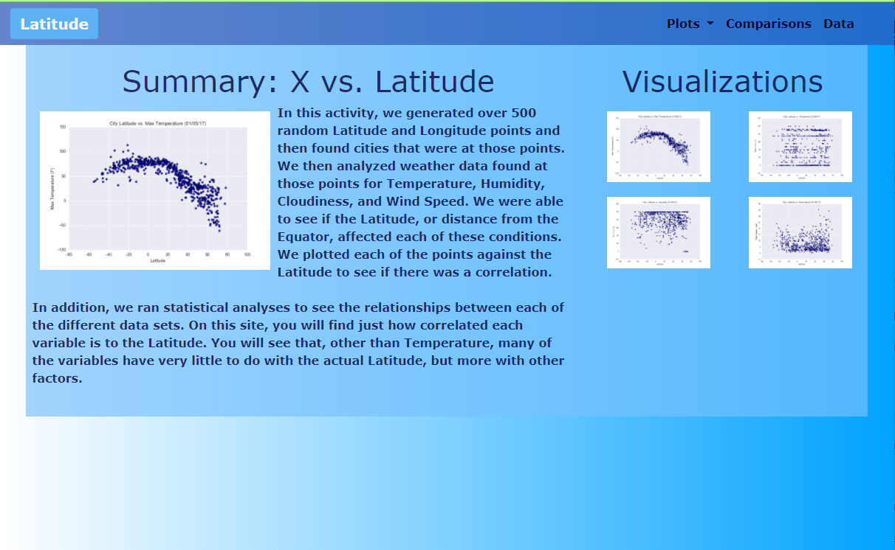

# Web-Design-Challenge
## Designing a Webpage in HTML

## Steps
* Create Landing page with an explantion of project previously done, links to each visualizations page, and a sidebar with preview images that are linked to the correct pages.
* Create separate pages for each visualization with descriptive title and heading, the image, and a paragraph describing the plot and its significance.
* Create a comparisons page that contains all four visualizations on the same page to easily compare that changes the size of the boxes on smaller screens.
* Create a data page that shows our data used for the visualizations in a responsive table as a bootstrap component.
* Create a navigation bar/menu containing a dropdown menu for plots, a link to comparisons, and a link to Data
* Deploy page to GitHub pages.

## Tools/Technologies Employed
* HTML 
* Bootstrap
* CSS

